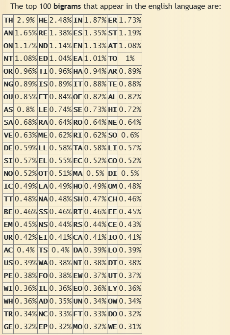

# Kriptanalisis Playfair Cipher

Cyber Fox menemukan dokumen lain yang tampak tidak sesuai dengan pola Vigenère. Struktur karakter yang dihasilkan tidak sepenuhnya masuk akal. Ini membuatnya curiga bahwa sebagian dokumen mungkin telah dienkripsi menggunakan metode lain. Setelah meneliti lebih lanjut, Cyber Fox menyadari bahwa bagian tersebut dienkripsi menggunakan Playfair cipher, metode enkripsi yang menggunakan tabel 5x5 untuk mengenkripsi pasangan huruf.

Untuk membongkar Playfair cipher, Cyber Fox mulai mengidentifikasi digram (pasangan huruf) yang sering muncul dalam ciphertext. Dengan membandingkan frekuensi ini terhadap distribusi normal dalam bahasa yang digunakan, ia mulai menebak isi dari matriks kunci Playfair. Langkah demi langkah, ia membangun kembali tabel kunci yang digunakan untuk mengenkripsi pesan. Mari bantu Cyber Fox menuntaskan misinya!

## Diketahui

- Cipher: Playfair Cipher
- Dimensi tabel Key: 5x5
- Bahasa: Inggris
- Tipe n-gram: Digram
- Ciphertext:
  ```txt
  DCXQCQAIIUFZGRBIIBTKGSTBWCOIQCDNNGTINEDQSOGKRPENTNPOQMNGTIGVGLBPRSCEMNGZRSXSKGCSMCPNTKBFHRSNVTSXBIQDESNVNSPCRMEQDPMNDXWCCBXREFFVIBKOIGTIDMKFGLWCFEIKFCISLIPSNYNFEWHRKGHQCESUPEKGCKPOIKVGDNOAGNXQCWCQDWBLUIGCRNMKSITVCGIKIMWCKCGZDIIBKOIGFGKCRLGWQNQRISUERNNFKDENUMBIPESHNBCWHMGLPEDCXQNGPCRKCWIVLSSIRPMAIUMNRNGKRPLIDUXDXBCOBIXNNFGNRGOQWCKGTNDNGWQNQRISUEWGBPSGLIDGSASNPNLGIBKOIGFGKRLEDNPOMNFNBNZQCEDIPSEPEDZGRGTINBEFRGITBTRZWCOIQRISPVPSTIDICWGCISERNGPCSKRMQFZRIDNFGLNESQFNDUBRAMKDSRPKGNNFGLNEASIDNEAMEYEGNRPEFQWCEFNFNKNERTGWQNQRISUERNZMCTDISHSNGNNPRGLINFRHDCXQCQAIIUEALRDNOAGNXGIBGLSHNSABFEKFCWQADAGAWCPMLVGKBFUSNGKRNMCWQDRSCEDQSOSKIKSKVGGRCQPEAMIDDWOQNSIKNDXRKFBIIBTKGSBLDNOAGNXQIGTNNXNBRMQFPEIDTVNERQCIHIRMKIMBHIIVAMOQNGPCRMEPQDKFPIHISCXFTNGWQNRPLPFNDUBRKFGKSPOIMWFEMQPCRGOQNBAMMLNGKQNGPCNRUEDIRGGLBFMNGZHGGINRUEDINECGWOOKFENEKFFNDKPEKQGWPKNSNHOPCPSKUESHFNRNNRUEDIIMKSGQSGIDTNGWQNIMSGIRQDNBNYNFIRMANEASZNFXGMZKIDUSNATIDGFPPHTNZGKITVRGLVWCFEGEEGKOCKZDSNPNCYSRPCNDDWLIREDIFESRGAENEGKRTKRHZSTNBPPELQWODITNGWQNIKSKVGGRNFKDENUMBIKRLEIDKHMNGZHGGIPEDCXQNGPCFVPIMNPRNGTIERAISUDGFPPHTNWFGRCGSEQKRPLIIKOCDNPCGLAONKNETFBFNHVGUMSIFNEAAMCEDIRLWCBIGHPKHRPBTKSKDWTNPXNGTNPCNFOQWCSIWTGWQNQRISUEGFAOBIDNOAGNWFPXPEBRCPCQTCWQLIDNIDTWHMKGBLPWPCGLCWTIUSKFBPGKRNSKOINENRMNBIIKODPOQMKGNGPCSKNEHFSRSESNGNZY
  ```

## Steps

1. Frekuensi analisis digram
2. Perbandingan hasil frekuensi analisis terhadap distribusi normal
3. Menebak isi matriks kunci Playfair
4. Langkah demi langkah membangun kembali tabel kunci yang digunakan untuk enkripsi pesan

### Notes

- Dalam proses pembuatan ciphertext, seluruh karakter dalam plainteks diubah
menjadi huruf kapital. 
- Enkripsi hanya diterapkan pada karakter alfabet (A–Z), sementara karakter nonalfabet seperti angka, spasi, koma, titik, dan simbol lainnya diabaikan dan tidak disertakan dalam hasil enkripsi.
- Diperbolehkan menggunakan pendekatan Brute Force atau Exhaustive Key Search, tetapi hanya sebagai pembanding dengan metode kriptanalisis.

## Solve

1. Frekuensi analisis diagram menggunakan program Python [freq_analysis.py](./freq_analysis/freq_analysis.py) untuk mendapatkan top 20 digram dalam bahasa inggris.

    Hasilnya dapat dilihat pada [freq_analysis/out.txt](./freq_analysis/out.txt)

2. Perbandingan hasil frekuensi analisis terhadap distribusi normal menggunakan program Python ...

3. Menebak isi matriks kunci Playfair

4. Langkah demi langkah membangun kembali tabel kunci yang digunakan untuk enkripsi pesan

## Output

- Tabel frekuensi kemunculan pasangan huruf (digram) dalam bahasa Inggris

  Top 100 bigrams dalam bahasa Inggris:

  
  Sumber: [dcode.fr/bigrams](https://www.dcode.fr/bigrams)

- Tabel frekuensi kemunculan pasangan huruf (digram) dalam ciphertext

  [Output hasil analisis digram (EN)](./freq_analysis/out.txt)

- Dokumentasi langkah-langkah analisis dalam pemecahan cipher

  1. Diketahui bahwa bahasa yang digunakan adalah bahasa Inggris dan enkripsi Playfair cipher berbasis bigram

  2. Gunakan program python [freq_analysis.py](freq_analysis/freq_analysis.py) untuk menemukan bigram yang paling umum digunakan

  3. 

- Plaintext hasil dekripsi
- Kunci enkripsi
- Kode Python yang digunakan (jika ada)
- Waktu kriptanalisis yang dibutuhkan
- Perbandingan dengan pendekatan Brute Force / Exhaustive Key Attack (optional)